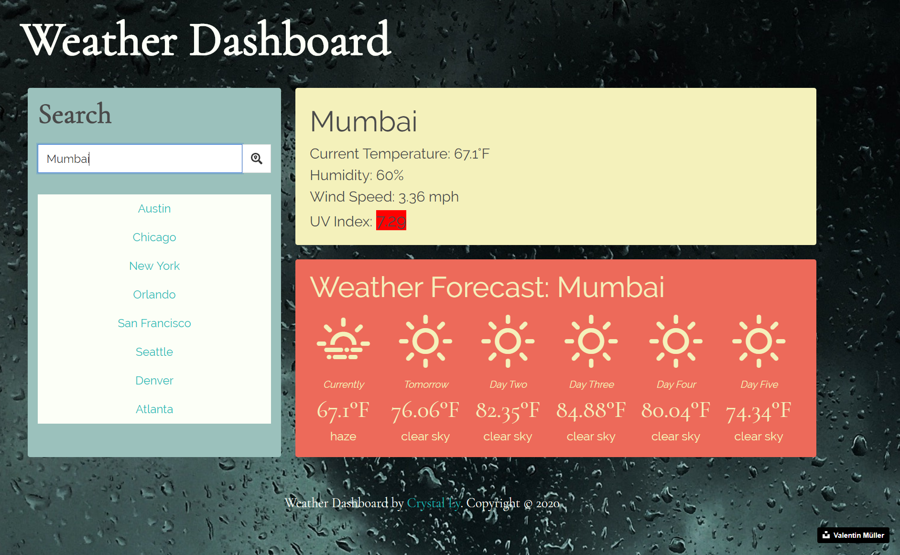
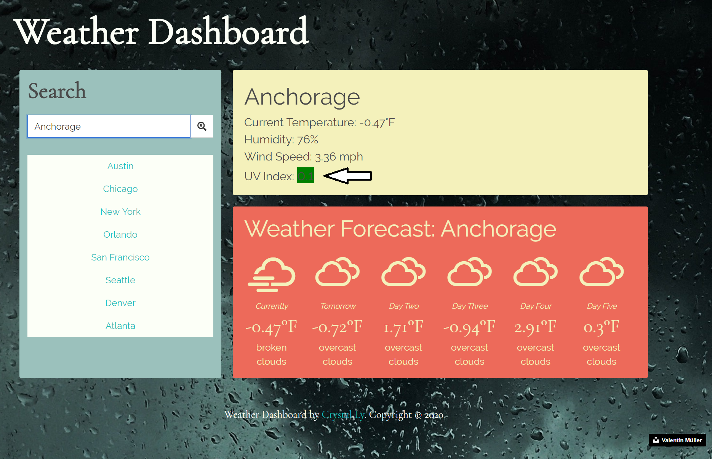

# Weather-Dashboard
A weather dashboard application with search functionality to find current weather conditions and the future weather outlook for multiple cities.

## Getting Started

These instructions will help you find the weather and weather forecast for any city you search for.
* [Click Here!](https://cml2377.github.io/weather-dashboard/)

## How it Works

Input a city name from anywhere in the world or click on any of the buttons below.
Click on search or press enter to return results for any location near you, along with a 5 day weather forecast.

You can click on the UV index number to open up a new tab with Wikipedia's chart on UV Indices and their meanings.

## Built With

* [Weather](https://openweathermap.org/) - I used Open Weather Map to grab current and future weather of the location you select.
* [Weather Icons](https://github.com/erikflowers/weather-icons/) - We used Erik Flowers' beautiful weather icons.
* [Bulma](https://bulma.io/documentation/) - I used Bulma CSS framework. 
* [Unsplash](https://unsplash.com/) - I used copyright-free images from this site.
* [Google Fonts](https://fonts.google.com/) - I used 2 font styles from Google Fonts.

## Author

* [Crystal Ly](https://github.com/cml2377)